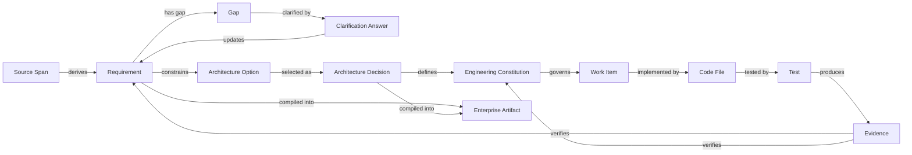

# Axiom: AI Engineering Operating System

## Software Requirements Specification

**Document ID:** AX-SRS-MVP-001  
**Version:** 1.0  
**Date:** 2026-07-16  
**Status:** Approved for hackathon implementation  
**Classification:** Internal / Hackathon  
**Authors:** Prashant Verma and Kshitij Sharma  
**Working product name:** Axiom (provisional)

---

## Document Control

| Field | Value |
|---|---|
| Product | Axiom: AI Engineering Operating System |
| Product thesis | A living reasoning and evidence layer for software engineering |
| Hackathon objective | Demonstrate one complete journey from ambiguous business intent to approved engineering decisions, enterprise artifacts, generated code, real verification evidence, and explainable traceability |
| Primary audience | Codex, product owners, architects, developers, QA engineers, hackathon judges |
| Build window | Four days |
| MVP priority convention | P0 = mandatory, P1 = stretch, P2 = future |
| Source of truth | Structured project graph stored by the application, not generated Markdown documents |

---

# 0. Codex Build Directive

Codex shall treat this SRS as the product contract.

1. Implement **P0 requirements first**. Do not begin P1 work until all P0 acceptance criteria pass.
2. Build one complete vertical journey. Do not create empty modules, decorative agents, fake test results, or non-functional integrations.
3. All AI outputs must be schema-validated before being persisted or rendered.
4. Any claim about code quality, test coverage, performance, security, or accessibility must originate from a real tool execution. The model may explain a result but may not invent it.
5. Every important recommendation must expose:
   - why it was suggested;
   - why alternatives were not selected;
   - assumptions;
   - risks;
   - conditions that should trigger reconsideration.
6. Use one TypeScript monorepo and the approved stack in Section 12 unless a blocking issue is documented.
7. Generated code shall be limited to a controlled starter workspace and fixed dependencies during the MVP.
8. A feature is complete only when its acceptance criteria and relevant automated tests pass.

---

# 1. Introduction

## 1.1 Purpose

This document defines the requirements for Axiom, an AI-powered engineering operating system that converts business intent into structured requirements, architecture decisions, enterprise documentation, implementation tasks, generated code, verified engineering evidence, and a traceable explanation of why each decision was made.

The document has two purposes:

1. Provide Codex with an implementation-ready specification for a four-day hackathon MVP.
2. Preserve the architecture and domain concepts needed to evolve the MVP into a scalable enterprise platform.

## 1.2 Product Vision

Axiom shall become a living engineering twin of a software product. It should understand:

- what the business requested;
- why the request exists;
- which requirements were derived;
- which gaps remain unresolved;
- which architecture options were considered;
- why one option was selected and others rejected;
- which engineering rules govern implementation;
- which code implements each requirement;
- which tests and scans verify the implementation;
- which deployment and runtime observations confirm or contradict earlier assumptions.

The long-term platform covers the full software delivery lifecycle. The hackathon MVP proves the central product thesis through one end-to-end flow.

## 1.3 Product Thesis

Existing tools often automate a single stage of delivery. Axiom shall own the reasoning and evidence that connect stages.

The product's core differentiator is:

> **Why, Why Not, and Proof**

For every important engineering outcome, the platform should answer:

- **What:** What was requested, decided, built, tested, or deployed?
- **Why:** Why was this decision or implementation selected?
- **Why not:** Why were reasonable alternatives rejected?
- **Proof:** What deterministic evidence confirms the claim?
- **When to reconsider:** Which changed assumption or threshold should reopen the decision?

## 1.4 Business Problem

Software teams lose time and quality because intent, requirements, decisions, tasks, code, tests, and operational evidence are stored in separate systems and interpreted independently.

Common consequences include:

- incomplete or conflicting requirements;
- missing non-functional requirements;
- architecture choices without documented trade-offs;
- coding agents inventing unspecified behavior;
- enterprise documents becoming stale;
- test results disconnected from requirements;
- unverified AI claims;
- duplicated discussions about old decisions;
- production behavior invalidating assumptions without triggering review;
- compliance evidence being assembled manually after the work is complete.

## 1.5 Product Goals

The MVP shall demonstrate that Axiom can:

1. Turn an ambiguous product brief into a structured engineering model.
2. Identify material gaps and ask high-impact clarification questions.
3. Generate functional requirements and NFRs grounded in the input and answers.
4. Compare architecture options using explicit trade-offs and assumptions.
5. Record the selected option as an explainable Architecture Decision Record.
6. Generate enterprise-style artifacts from one canonical project graph.
7. Create a controlled implementation plan and generated code for one vertical feature.
8. Execute real unit, API, coverage, security, and performance checks where implemented.
9. Normalize results into evidence with explicit truth status.
10. Answer "why" questions by traversing traceable project relationships.

## 1.6 Non-Goals for the Hackathon

The MVP shall not attempt to:

- join live meetings;
- transcribe audio or identify speakers;
- replace Jira, GitHub, GitLab, cloud providers, or monitoring platforms;
- generate an entire production application from scratch;
- support arbitrary repositories or arbitrary shell commands;
- execute real payments, email, SMS, or production deployment;
- claim legal, security, accessibility, or regulatory certification;
- support multi-tenant enterprise administration;
- implement full GRC control libraries;
- implement all cloud providers;
- use several models merely to create an appearance of complexity.

## 1.7 Intended Audience

- Product owners and business analysts
- Solution and software architects
- Engineering managers
- Developers using Codex or other coding agents
- QA and performance engineers
- Security and compliance stakeholders
- Hackathon reviewers

## 1.8 Definitions

| Term | Definition |
|---|---|
| Engineering Twin | A structured, evolving representation of intent, requirements, decisions, code, verification, and runtime evidence |
| Project Graph | The canonical graph of artifacts and relationships used as the source of truth |
| Artifact | A generated or imported engineering object such as SRS, HLD, ADR, test strategy, OpenAPI contract, or task |
| Decision Record | A versioned record of a technical decision, alternatives, reasoning, assumptions, risks, and reconsideration triggers |
| Engineering Constitution | A machine-readable set of project rules that coding and verification workflows must follow |
| Evidence | A deterministic result produced by an executed tool, human approval, or observed runtime system |
| Trace Link | A typed relationship between two project entities |
| Gap | Missing, conflicting, ambiguous, or untestable information that affects delivery |
| Truth Status | The provenance and reliability state assigned to a claim or result |
| Vertical Slice | One end-to-end product capability that includes requirements, code, tests, and evidence |

---

# 2. Product Scope

## 2.1 Long-Term Product Scope

The full product vision includes:

1. Meeting and business-intent ingestion
2. Requirement and NFR intelligence
3. Clarification and conflict resolution
4. Enterprise document compilation
5. Architecture decision support
6. Engineering standards and policy enforcement
7. Backlog and dependency planning
8. AI-assisted implementation
9. Unit, integration, API, E2E, performance, security, and accessibility verification
10. Cloud architecture, deployment, and cost optimization
11. Monitoring, incident feedback, and architecture drift detection
12. Engineering GRC and audit evidence
13. Cross-tool and cross-project institutional memory

## 2.2 Hackathon MVP Scope

The MVP shall implement one controlled workflow:

```text
Product brief
   -> requirement and NFR extraction
   -> gap detection
   -> clarification answers
   -> architecture comparison
   -> approved decision
   -> enterprise artifact generation
   -> engineering constitution
   -> one generated API vertical slice
   -> real verification runs
   -> evidence graph
   -> Why / Why Not / Proof explorer
```

## 2.3 P0 Mandatory Capabilities

- Project creation from a supplied sample or pasted product brief
- Structured requirement and NFR extraction
- Source-backed gap detection
- Three to five prioritized clarification questions
- Architecture comparison with at least three options
- Decision approval and ADR creation
- Engineering Constitution generation
- SRS, NFR, HLD, ADR, OpenAPI, test strategy, and backlog artifacts
- Controlled code generation for one API feature
- Real unit and API test execution
- Real coverage collection
- Evidence normalization and display
- Requirement-to-decision-to-code-to-test traceability
- Why / Why Not / Proof queries
- Export of project artifacts as Markdown and JSON

## 2.4 P1 Stretch Capabilities

- Dependency and security scan
- Performance test execution and parsed metrics
- Mermaid architecture diagram
- Readiness score animation
- Cost estimate for a single AWS architecture using a maintained local price snapshot
- Accessibility scan for a generated admin page
- ZIP download of all artifacts
- Rerun after a clarification or implementation change

## 2.5 P2 Future Capabilities

- Live meeting integrations
- Jira, Linear, GitHub, GitLab, Notion, and Confluence integrations
- Bring-your-own enterprise templates
- Multi-model routing
- Mobile app generation and testing
- Real AWS, Azure, and GCP provisioning
- Cloud billing ingestion and optimization
- Production monitoring and architecture drift
- On-premises runner and private VPC deployment
- GRC control packs and evidence mapping
- Organization-level analytics

## 2.6 MVP Success Definition

The MVP is successful when a user can complete the primary demo journey without editing database records, changing source code, or relying on pre-rendered results, and the platform can answer at least these questions with traceable evidence:

1. Why was the selected architecture recommended?
2. Why was a more complex architecture rejected?
3. Which requirement caused a particular code module to be created?
4. Which executed test proves a behavior?
5. Which claims are still unverified?

---

# 3. Users and Roles

## 3.1 Product Owner / Business Analyst

Needs to:

- provide business intent;
- review extracted requirements;
- answer gaps and ambiguities;
- approve scope and business rules;
- export enterprise documents.

## 3.2 Architect / Engineering Lead

Needs to:

- compare architecture options;
- inspect trade-offs, costs, assumptions, and failure modes;
- approve or reject a recommendation;
- define engineering rules;
- understand when a decision should be reconsidered.

## 3.3 Developer

Needs to:

- receive implementation-ready requirements;
- understand why code exists;
- follow the Engineering Constitution;
- generate or modify code;
- see verification failures linked to affected requirements.

## 3.4 QA / Reliability Engineer

Needs to:

- derive test scenarios from requirements and risks;
- run real checks;
- distinguish model suggestions from executed evidence;
- inspect coverage, API results, performance results, and unresolved gaps.

## 3.5 Reviewer / Judge

Needs to:

- experience the entire product journey quickly;
- inspect a coherent project graph;
- distinguish real execution from generated text;
- understand future enterprise value.

## 3.6 MVP Access Model

Authentication is not required for the hackathon MVP. The application shall support one anonymous browser session and one preloaded sample project. Enterprise roles and permissions are P2.

---

# 4. Product Principles

## 4.1 Canonical Structured Data

The project graph is the source of truth. Documents are compiled views of that graph. The MVP shall avoid treating generated Markdown as the primary editable database.

## 4.2 Evidence Before Assertion

The platform shall never display an engineering claim as verified unless an approved deterministic source produced it.

## 4.3 Human Approval at Decision Boundaries

AI may recommend an architecture or policy. A human user shall approve the architecture decision before code generation begins.

## 4.4 Explicit Uncertainty

Missing information shall be represented as `UNKNOWN`, not silently completed by the model.

## 4.5 Reproducibility

Verification runs shall store command, timestamp, exit code, parsed metrics, and a bounded raw-output excerpt.

## 4.6 Practical Integration Strategy

The platform shall orchestrate existing tools rather than reimplement every engineering discipline.

## 4.7 Progressive Enterprise Adoption

The future architecture shall allow sensitive code and execution to remain in a customer-controlled runner while the hosted control plane stores approved metadata and evidence.

---

# 5. Truth and Evidence Model

## 5.1 Truth Status Enumeration

All meaningful claims shall use one of the following states:

| Status | Meaning |
|---|---|
| `AI_SUGGESTED` | Generated by a model and not approved or independently verified |
| `HUMAN_APPROVED` | Accepted by an authorized user |
| `TOOL_EXECUTED` | A real tool ran and returned a result |
| `TOOL_VERIFIED` | Tool output satisfied a deterministic threshold or assertion |
| `RUNTIME_OBSERVED` | Confirmed through runtime telemetry |
| `UNKNOWN` | Evidence is absent or insufficient |
| `CONTRADICTED` | Available evidence conflicts with the claim |
| `FAILED` | Execution failed and no valid conclusion can be drawn |

## 5.2 Evidence Requirements

Each Evidence record shall include:

- unique ID;
- project ID;
- evidence type;
- producer type and name;
- truth status;
- timestamp;
- command or operation;
- exit code where applicable;
- parsed measurements;
- bounded raw output;
- linked requirements, risks, decisions, code files, and tests;
- optional artifact hash;
- optional reviewer note.

## 5.3 Prohibited Behaviors

The system shall not:

- invent coverage percentages;
- invent passing tests;
- present an architecture estimate as runtime-observed fact;
- mark accessibility as fully compliant based only on an automated scan;
- rewrite failed tool output into a success narrative;
- create a source quotation that does not exist in the submitted input;
- hide unknowns to increase a readiness score.

---

# 6. Functional Requirements

Priority meanings:

- **P0:** Mandatory for hackathon completion
- **P1:** Implement only after P0 is stable
- **P2:** Future roadmap

## 6.1 Project Workspace

| ID | Requirement | Priority | Acceptance Condition |
|---|---|---:|---|
| FR-PROJ-001 | The system shall allow a user to create a project with name, summary, target domain, and optional constraints. | P0 | A project is created and assigned a stable ID. |
| FR-PROJ-002 | The system shall provide a preloaded sample project named `NotifyFlow`. | P0 | The sample can be launched in one click and contains the approved demo brief. |
| FR-PROJ-003 | The system shall persist the project state for the active demo environment. | P0 | Refreshing the browser does not lose the current project during the demo. |
| FR-PROJ-004 | The system shall display the project lifecycle status. | P0 | Status shows one of `Draft`, `Analyzing`, `Needs Clarification`, `Architecture Review`, `Ready to Build`, `Verifying`, `Complete`, or `Failed`. |
| FR-PROJ-005 | The system shall allow the user to reset the sample project. | P0 | Reset returns the sample to its initial state. |

## 6.2 Intent Ingestion

| ID | Requirement | Priority | Acceptance Condition |
|---|---|---:|---|
| FR-ING-001 | The system shall accept a pasted product brief of at least 50 and at most 15,000 characters. | P0 | Valid input can be submitted; invalid size is rejected with a clear message. |
| FR-ING-002 | The system shall support `.txt` and `.md` upload. | P1 | Uploaded text is previewed before analysis. |
| FR-ING-003 | The system shall preserve the original input as an immutable source artifact. | P0 | Source content has an ID, creation time, and content hash. |
| FR-ING-004 | The system shall split source text into addressable spans. | P0 | Extracted requirements can link to exact source excerpts. |
| FR-ING-005 | The system shall reject empty, binary, or unsupported input. | P0 | User receives an actionable validation message. |

## 6.3 Requirement Intelligence

| ID | Requirement | Priority | Acceptance Condition |
|---|---|---:|---|
| FR-REQ-001 | The system shall extract business goals. | P0 | At least one goal is produced for the sample brief. |
| FR-REQ-002 | The system shall extract functional requirements with stable IDs such as `FR-001`. | P0 | Requirements are rendered and persisted with unique IDs. |
| FR-REQ-003 | The system shall extract non-functional requirements with category, metric, target, and status. | P0 | NFRs include measurable values when present and `UNKNOWN` when absent. |
| FR-REQ-004 | The system shall extract actors, roles, and permissions. | P0 | Actor list is visible and linked to related requirements. |
| FR-REQ-005 | The system shall extract business rules, constraints, assumptions, dependencies, and risks. | P0 | Each category appears in structured output. |
| FR-REQ-006 | The system shall attach one or more source excerpts to every grounded requirement. | P0 | Clicking a requirement displays its exact source excerpt. |
| FR-REQ-007 | The system shall label inferred items as assumptions rather than source-backed requirements. | P0 | Inferred items have `AI_SUGGESTED` status and no fabricated quote. |
| FR-REQ-008 | The system shall detect duplicate or near-duplicate requirements. | P1 | Duplicate candidates are grouped for review. |
| FR-REQ-009 | The system shall detect contradictions between requirements or constraints. | P0 | At least one seeded contradiction can be surfaced in a test fixture. |
| FR-REQ-010 | The system shall classify requirements by priority and implementation readiness. | P0 | Each requirement displays priority and readiness. |
| FR-REQ-011 | The system shall calculate a deterministic requirement-readiness score. | P0 | Score is derived from a documented rubric and changes after clarification. |
| FR-REQ-012 | The system shall allow a user to approve or reject an extracted requirement. | P1 | Approval state persists and affects artifact generation. |

## 6.4 Gap Detection and Clarification

| ID | Requirement | Priority | Acceptance Condition |
|---|---|---:|---|
| FR-GAP-001 | The system shall identify missing decisions that materially affect architecture, implementation, testing, security, performance, cost, or operations. | P0 | The sample project produces at least five gaps. |
| FR-GAP-002 | Each gap shall include severity, affected artifacts, rationale, and source context. | P0 | Gap details are visible in the UI. |
| FR-GAP-003 | The system shall rank gaps by estimated implementation impact. | P0 | Blocking gaps appear before informational gaps. |
| FR-GAP-004 | The system shall generate three to five clarification questions for the MVP. | P0 | Questions are context-specific and not generic checklists. |
| FR-GAP-005 | Each clarification question shall explain why it matters and which items it affects. | P0 | Affected requirement or NFR IDs are shown. |
| FR-GAP-006 | Questions shall support suggested options and custom text. | P0 | User can select an option or provide a custom answer. |
| FR-GAP-007 | An answer shall update the canonical project graph. | P0 | Requirements, business rules, assumptions, or NFRs update after answer submission. |
| FR-GAP-008 | The system shall recalculate readiness after each accepted answer. | P0 | Score changes are deterministic and visible. |
| FR-GAP-009 | The system shall prevent architecture approval while a P0 blocking gap remains unresolved. | P0 | Build action remains disabled and explains the blocker. |

## 6.5 Architecture Decision Lab

| ID | Requirement | Priority | Acceptance Condition |
|---|---|---:|---|
| FR-ARC-001 | The system shall generate at least three architecture options for the sample project. | P0 | Three distinct and plausible options are displayed. |
| FR-ARC-002 | Each option shall include components, data flow, deployment model, and key technologies. | P0 | Option detail contains all required fields. |
| FR-ARC-003 | Each option shall explain suitability, delivery effort, scalability, reliability, security, operational burden, team-skill fit, vendor lock-in, and cost range. | P0 | Comparison matrix is populated. |
| FR-ARC-004 | Each option shall state why it should be selected and why it may be rejected. | P0 | Both `why` and `whyNot` fields are present and non-empty. |
| FR-ARC-005 | Each option shall include explicit assumptions. | P0 | Assumptions are linked to relevant NFRs and risks. |
| FR-ARC-006 | Each option shall include failure modes and mitigations. | P0 | At least two failure modes are listed for each sample option. |
| FR-ARC-007 | Each option shall include reconsideration triggers. | P0 | At least one measurable trigger is present. |
| FR-ARC-008 | The system shall recommend one option while clearly labeling the recommendation as `AI_SUGGESTED`. | P0 | Recommendation is visible and not marked approved. |
| FR-ARC-009 | The user shall be able to approve an option or select a different option. | P0 | Selected option becomes `HUMAN_APPROVED`. |
| FR-ARC-010 | Approval shall create a versioned Architecture Decision Record. | P0 | ADR includes question, decision, alternatives, why, why not, assumptions, risks, and triggers. |
| FR-ARC-011 | The system shall generate a Mermaid architecture diagram from structured option data. | P1 | Diagram renders without syntax error for the sample project. |
| FR-ARC-012 | The system shall show the origin of each architecture constraint. | P1 | Constraint links back to requirement, NFR, user answer, or policy. |

## 6.6 Engineering Constitution

| ID | Requirement | Priority | Acceptance Condition |
|---|---|---:|---|
| FR-CON-001 | The system shall generate a machine-readable Engineering Constitution after architecture approval. | P0 | A valid YAML or JSON constitution is created. |
| FR-CON-002 | The constitution shall cover architecture boundaries, code quality, security, testing, performance, accessibility, deployment, and cost. | P0 | All categories exist, with `UNKNOWN` allowed where unresolved. |
| FR-CON-003 | Each constitution rule shall have an ID, severity, rationale, and verification method. | P0 | Rules are structured and visible. |
| FR-CON-004 | The user shall be able to approve or disable a generated rule. | P1 | Rule state persists and affects verification. |
| FR-CON-005 | Code generation prompts shall include the approved constitution. | P0 | Generated task context contains the constitution. |
| FR-CON-006 | Verification shall link failures to violated constitution rules where applicable. | P1 | Failed evidence displays the corresponding rule ID. |

## 6.7 Enterprise Artifact Compiler

| ID | Requirement | Priority | Acceptance Condition |
|---|---|---:|---|
| FR-DOC-001 | The system shall generate an SRS from the canonical graph. | P0 | Generated SRS contains scope, actors, FRs, NFRs, assumptions, constraints, and acceptance criteria. |
| FR-DOC-002 | The system shall generate an NFR specification. | P0 | NFR document contains metric, target, rationale, source, and verification method. |
| FR-DOC-003 | The system shall generate an HLD. | P0 | HLD contains context, components, flows, data stores, external dependencies, failure handling, security, and deployment view. |
| FR-DOC-004 | The system shall generate the approved ADR. | P0 | ADR faithfully represents the selected decision and rejected alternatives. |
| FR-DOC-005 | The system shall generate an OpenAPI contract for the demo vertical slice. | P0 | OpenAPI document parses successfully. |
| FR-DOC-006 | The system shall generate a test strategy. | P0 | Strategy maps test levels to requirements, risks, and NFRs. |
| FR-DOC-007 | The system shall generate an implementation backlog with epic, stories, acceptance criteria, dependencies, and priority. | P0 | Backlog contains at least one implementable vertical slice. |
| FR-DOC-008 | Generated documents shall include version, date, project ID, and source graph version. | P0 | Metadata is present in every artifact. |
| FR-DOC-009 | Regeneration shall replace stale generated content while preserving stable entity IDs. | P0 | Requirement and decision IDs remain stable after regeneration. |
| FR-DOC-010 | The UI shall mark generated artifacts as views of the canonical graph. | P0 | User is informed that direct document edits are not authoritative in MVP. |
| FR-DOC-011 | The system shall export artifacts as Markdown and JSON. | P0 | User can download or copy each artifact. |
| FR-DOC-012 | The system shall support enterprise template customization. | P2 | Future requirement only. |

## 6.8 Backlog and Plan Generation

| ID | Requirement | Priority | Acceptance Condition |
|---|---|---:|---|
| FR-PLAN-001 | The system shall create an epic for the selected sample capability. | P0 | Epic is linked to business goals and requirements. |
| FR-PLAN-002 | The system shall create stories with acceptance criteria and dependencies. | P0 | At least three stories are generated for the sample. |
| FR-PLAN-003 | The system shall identify a first vertical slice suitable for code generation. | P0 | One slice is marked `Selected for Build`. |
| FR-PLAN-004 | The system shall create a Codex task packet containing scope, files, constitution, acceptance criteria, and definition of done. | P0 | Packet can be copied as Markdown. |
| FR-PLAN-005 | The system shall show which requirements are deferred from the selected slice. | P0 | Deferred items are listed and remain traceable. |

## 6.9 Controlled Code Generation

| ID | Requirement | Priority | Acceptance Condition |
|---|---|---:|---|
| FR-CODE-001 | The system shall generate code only inside an approved starter workspace. | P0 | Model cannot write outside allowlisted paths. |
| FR-CODE-002 | The starter workspace shall use fixed dependencies and fixed execution commands. | P0 | No model-generated package installation is executed. |
| FR-CODE-003 | Code generation shall use approved requirements, OpenAPI contract, ADR, and Engineering Constitution. | P0 | Prompt provenance is recorded. |
| FR-CODE-004 | The system shall generate one vertical slice for `POST /notifications` and `GET /notifications/{id}` in the sample project. | P0 | Generated code compiles or returns a clearly reported failure. |
| FR-CODE-005 | The system shall display generated files and a unified diff. | P0 | User can inspect changed files before verification. |
| FR-CODE-006 | Generated code shall include unit and API tests derived from acceptance criteria. | P0 | Test files exist and reference requirement or test IDs. |
| FR-CODE-007 | The user shall be able to approve generated code for verification. | P0 | Verification cannot start before approval. |
| FR-CODE-008 | If code generation fails schema, path, or safety validation, the system shall reject the output. | P0 | Failure is shown without writing invalid files. |
| FR-CODE-009 | The system shall support arbitrary customer repositories. | P2 | Future requirement only. |

## 6.10 Verification and Evidence

| ID | Requirement | Priority | Acceptance Condition |
|---|---|---:|---|
| FR-VER-001 | The system shall run a TypeScript compile or build check against the generated workspace. | P0 | Exit code and output are captured. |
| FR-VER-002 | The system shall run unit tests. | P0 | Actual pass/fail counts are displayed. |
| FR-VER-003 | The system shall run API tests against the generated service using an in-process or local test harness. | P0 | At least one success and one validation/error scenario execute. |
| FR-VER-004 | The system shall collect real code coverage. | P0 | Line, branch, function, and statement coverage are parsed from tool output. |
| FR-VER-005 | The system shall compare coverage against constitution thresholds. | P0 | Threshold result is deterministic. |
| FR-VER-006 | The system shall run a dependency or static security scan. | P1 | Findings and severity are parsed from a real scanner. |
| FR-VER-007 | The system shall run a performance test against the generated endpoint. | P1 | Throughput, p50, p95, p99, and error rate are captured. |
| FR-VER-008 | The system shall run an accessibility scan if a UI slice exists. | P1 | Automated findings are reported without claiming full compliance. |
| FR-VER-009 | Each verification run shall record command, start time, duration, exit code, parsed metrics, and bounded raw output. | P0 | Evidence record is complete. |
| FR-VER-010 | The model may summarize evidence but shall not change measured values. | P0 | Displayed metrics exactly match stored parsed metrics. |
| FR-VER-011 | The system shall map each test to one or more requirements or NFRs. | P0 | Traceability view shows test-to-requirement links. |
| FR-VER-012 | The system shall mark untested requirements as `UNKNOWN`, not passed. | P0 | Uncovered items are visible. |
| FR-VER-013 | Failed commands shall produce `FAILED` evidence and actionable diagnostics. | P0 | Failure is not converted into a pass. |
| FR-VER-014 | The user shall be able to rerun verification after a code regeneration. | P1 | A second run creates a new evidence version. |

## 6.11 Traceability Graph

| ID | Requirement | Priority | Acceptance Condition |
|---|---|---:|---|
| FR-TRACE-001 | The system shall maintain typed links among source spans, requirements, NFRs, gaps, answers, decisions, artifacts, tasks, code files, tests, and evidence. | P0 | Links persist and can be queried. |
| FR-TRACE-002 | The system shall provide a visual traceability view. | P0 | User can navigate from a requirement to decision, code, test, and evidence. |
| FR-TRACE-003 | The system shall display orphaned requirements and unlinked tests. | P0 | Orphans are shown as gaps. |
| FR-TRACE-004 | The system shall preserve stable IDs across document regeneration. | P0 | Existing trace links remain valid. |
| FR-TRACE-005 | The system shall provide a list view fallback for accessibility and small screens. | P0 | Traceability remains usable without the graph. |
| FR-TRACE-006 | The system shall export traceability as JSON. | P0 | Export contains nodes and typed edges. |

## 6.12 Why / Why Not / Proof Explorer

| ID | Requirement | Priority | Acceptance Condition |
|---|---|---:|---|
| FR-WHY-001 | The system shall answer predefined and free-text questions about the current project. | P0 | Sample questions return grounded responses. |
| FR-WHY-002 | Answers shall be generated from project graph entities and links, not from general model memory alone. | P0 | Each answer cites internal entity IDs. |
| FR-WHY-003 | The system shall support `Why was X selected?` queries. | P0 | Answer includes decision rationale and supporting constraints. |
| FR-WHY-004 | The system shall support `Why not Y?` queries. | P0 | Answer includes rejected alternative reasoning. |
| FR-WHY-005 | The system shall support `What proves Z?` queries. | P0 | Answer includes executed evidence or explicitly states `UNKNOWN`. |
| FR-WHY-006 | The system shall support `What would make us reconsider?` queries. | P0 | Answer lists decision triggers and linked assumptions. |
| FR-WHY-007 | The system shall not claim proof when only AI suggestions exist. | P0 | Response distinguishes recommendation from evidence. |
| FR-WHY-008 | The system shall show the traversal path used to construct the answer. | P1 | User can inspect linked nodes and edges. |

## 6.13 History and Export

| ID | Requirement | Priority | Acceptance Condition |
|---|---|---:|---|
| FR-EXP-001 | The system shall version major analysis, decision, artifact, code, and verification events. | P0 | Timeline displays at least one version per stage. |
| FR-EXP-002 | The system shall export the artifact pack as individual Markdown and JSON files. | P0 | Files are downloadable. |
| FR-EXP-003 | The system shall export the complete pack as a ZIP. | P1 | ZIP contains documents, constitution, OpenAPI, traceability, and evidence summary. |
| FR-EXP-004 | The system shall include a machine-readable manifest. | P0 | Manifest lists artifact IDs, types, versions, and hashes. |
| FR-EXP-005 | The system shall allow sample reset without affecting application code. | P0 | Reset works from the UI. |

---

# 7. Primary User Journey

## 7.1 End-to-End Flow

1. User opens Axiom.
2. User selects `Try NotifyFlow Sample` or creates a project.
3. User reviews the product brief and starts analysis.
4. System extracts goals, requirements, NFRs, constraints, risks, and gaps.
5. System displays a deterministic readiness score and prioritized blockers.
6. User answers three to five high-impact clarification questions.
7. System updates the project graph and readiness score.
8. System generates three architecture options.
9. User compares why, why not, assumptions, risks, cost range, and triggers.
10. User approves one option.
11. System creates an ADR, Engineering Constitution, and enterprise artifacts.
12. User selects the first vertical slice and generates the Codex task packet.
13. System generates code in the controlled workspace.
14. User inspects the diff and approves verification.
15. System runs real build, unit, API, and coverage commands.
16. System displays evidence and unverified items.
17. User opens the traceability view.
18. User asks why the architecture was chosen and what proves retry behavior.
19. System answers with entity links and real evidence.
20. User exports the artifact pack.

## 7.2 Required Demo Outcome

For the NotifyFlow sample, the demo shall end with:

- one human-approved architecture decision;
- one generated and valid OpenAPI contract;
- generated code for create and get notification endpoints;
- passing or honestly failing test results;
- real coverage metrics;
- a requirement-to-code-to-test-to-evidence path;
- at least one intentionally unresolved item shown as `UNKNOWN`;
- a clear why-not explanation for Kafka or an equivalent over-complex option.

---

# 8. User Interface Requirements

## 8.1 Navigation

The MVP shall use a project workspace with these primary sections:

1. **Intent**
2. **Requirements**
3. **Architecture**
4. **Artifacts**
5. **Build**
6. **Verify**
7. **Traceability**
8. **Why**

A horizontal lifecycle indicator may be used on desktop. A compact step list shall be available on smaller screens.

## 8.2 Screen: Landing / Project Start

Required elements:

- Product title and one-sentence value proposition
- `Try NotifyFlow Sample` primary action
- `Create Project` secondary action
- Brief privacy statement
- No authentication wall

## 8.3 Screen: Intent

Required elements:

- Project metadata
- Source input editor or sample preview
- Character count
- Start-analysis action
- Validation and error state
- Immutable source identifier after submission

## 8.4 Screen: Requirements

Required elements:

- Readiness score
- Tabs or filters for FR, NFR, gaps, assumptions, risks, and dependencies
- Requirement cards with source evidence
- Gap severity and impact
- Clarification question panel
- Before-and-after score change

## 8.5 Screen: Architecture

Required elements:

- Three-option comparison
- Recommended option indicator
- Why, Why Not, assumptions, failure modes, and triggers
- Cost range marked as estimate
- Approve decision action
- ADR preview

## 8.6 Screen: Artifacts

Required elements:

- Artifact list with type and version
- SRS, NFR, HLD, ADR, OpenAPI, test strategy, backlog, constitution
- Markdown preview
- Copy and download actions
- Regenerate action

## 8.7 Screen: Build

Required elements:

- Selected vertical slice
- Codex task packet
- Generated file tree
- Unified diff
- Generation status and errors
- Approve for verification action

## 8.8 Screen: Verify

Required elements:

- Verification cards for build, unit, API, coverage, security, performance, and accessibility
- Actual command status
- Metrics and thresholds
- Bounded raw output viewer
- Truth status badge
- Requirement coverage matrix
- Rerun action if implemented

## 8.9 Screen: Traceability

Required elements:

- Graph view for desktop
- List/tree fallback
- Node filters
- Orphan and unknown indicators
- Click-through detail drawer

## 8.10 Screen: Why

Required elements:

- Suggested questions
- Free-text input
- Answer with entity citations
- Distinct sections for `Why`, `Why Not`, `Proof`, and `Reconsider When`
- Explicit unknown statement when proof is unavailable

## 8.11 UI State Requirements

Every asynchronous feature shall implement:

- idle state;
- loading state;
- success state;
- empty state;
- validation error state;
- tool/model failure state;
- retry where safe.

The application shall not display fake streaming progress. If progress is shown, it shall represent real completed stages.

---

# 9. Domain Model

## 9.1 Core Entities

### Project

| Field | Type | Notes |
|---|---|---|
| id | UUID/string | Stable project ID |
| name | string | Required |
| summary | string | Required |
| domain | string | Example: SaaS, e-commerce, healthcare |
| status | enum | Lifecycle status |
| graphVersion | integer | Incremented after canonical changes |
| createdAt | timestamp | Required |
| updatedAt | timestamp | Required |

### SourceArtifact

| Field | Type | Notes |
|---|---|---|
| id | string | Stable ID |
| projectId | string | Foreign key |
| type | enum | brief, transcript, document |
| content | text | Immutable for MVP |
| hash | string | Content hash |
| createdAt | timestamp | Required |

### SourceSpan

| Field | Type | Notes |
|---|---|---|
| id | string | Stable ID |
| sourceArtifactId | string | Foreign key |
| startOffset | integer | Inclusive |
| endOffset | integer | Exclusive |
| quote | string | Exact source text |

### Requirement

| Field | Type | Notes |
|---|---|---|
| id | string | Example `FR-001` |
| projectId | string | Foreign key |
| type | enum | functional, non-functional, business-rule, constraint |
| title | string | Short label |
| statement | text | Testable requirement |
| priority | enum | must, should, could |
| readiness | enum | ready, needs-clarification, blocked |
| truthStatus | enum | See Section 5 |
| confidence | number | 0 to 1 for model extraction |
| sourceSpanIds | string[] | Empty only for explicit assumptions |
| acceptanceCriteria | string[] | Structured statements |
| version | integer | Required |

### NFRDetail

| Field | Type | Notes |
|---|---|---|
| requirementId | string | Requirement foreign key |
| category | enum | performance, availability, security, accessibility, privacy, cost, maintainability, scalability, observability |
| metric | string | Example: p95 latency |
| target | string/number | May be `UNKNOWN` |
| unit | string | ms, percent, USD/month, etc. |
| verificationMethod | string | Tool or review approach |

### Gap

| Field | Type | Notes |
|---|---|---|
| id | string | Stable ID |
| type | enum | missing, ambiguous, conflicting, untestable |
| title | string | Required |
| description | text | Required |
| severity | enum | blocker, high, medium, low |
| impactAreas | string[] | architecture, security, testing, etc. |
| affectedEntityIds | string[] | Trace targets |
| status | enum | open, answered, accepted-risk, deferred |

### ClarificationQuestion

| Field | Type | Notes |
|---|---|---|
| id | string | Stable ID |
| gapId | string | Foreign key |
| question | string | Required |
| whyItMatters | text | Required |
| options | array | Label and value |
| answer | string/null | User answer |
| answeredAt | timestamp/null | Optional |

### ArchitectureOption

| Field | Type | Notes |
|---|---|---|
| id | string | Stable ID |
| name | string | Required |
| summary | text | Required |
| components | array | Structured components |
| dataFlows | array | Structured flows |
| technologies | string[] | Required |
| why | string[] | Reasons to select |
| whyNot | string[] | Reasons to reject |
| assumptions | string[] | Required |
| failureModes | array | Failure and mitigation |
| reconsiderationTriggers | array | Metric and threshold |
| scoreBreakdown | object | Deterministic or explained scoring |
| estimatedCost | object | Marked estimate |
| truthStatus | enum | Initially AI_SUGGESTED |

### ArchitectureDecision

| Field | Type | Notes |
|---|---|---|
| id | string | Example `ADR-001` |
| question | string | Decision being made |
| selectedOptionId | string | Approved option |
| rejectedOptionIds | string[] | Alternatives |
| rationale | string[] | Why selected |
| rejectedRationale | object | Why not per alternative |
| assumptions | string[] | Approved assumptions |
| risks | string[] | Known risks |
| reconsiderationTriggers | array | Required |
| status | enum | proposed, approved, superseded |
| truthStatus | enum | HUMAN_APPROVED after approval |
| approvedAt | timestamp | Required after approval |

### ConstitutionRule

| Field | Type | Notes |
|---|---|---|
| id | string | Example `SEC-001` |
| category | enum | architecture, quality, security, accessibility, performance, cloud, delivery |
| statement | string | Machine-readable intent |
| severity | enum | blocker, high, medium, low |
| rationale | text | Required |
| verificationMethod | string | Command/tool/manual |
| threshold | object/null | Optional |
| status | enum | proposed, approved, disabled |

### Artifact

| Field | Type | Notes |
|---|---|---|
| id | string | Stable ID |
| type | enum | srs, nfr, hld, adr, openapi, test-strategy, backlog, constitution, codex-task |
| version | integer | Required |
| content | text/json | Generated view |
| sourceGraphVersion | integer | Required |
| hash | string | Required |
| truthStatus | enum | AI_SUGGESTED or HUMAN_APPROVED |
| generatedAt | timestamp | Required |

### WorkItem

| Field | Type | Notes |
|---|---|---|
| id | string | Epic/story/task ID |
| type | enum | epic, story, task |
| title | string | Required |
| description | text | Required |
| acceptanceCriteria | string[] | Required |
| priority | enum | Required |
| dependencyIds | string[] | Optional |
| linkedRequirementIds | string[] | Required |
| selectedForBuild | boolean | Required |

### CodeFile

| Field | Type | Notes |
|---|---|---|
| id | string | Stable ID |
| path | string | Allowlisted path |
| content | text | Current generated content |
| hash | string | Required |
| linkedEntityIds | string[] | Requirements, rules, tasks |
| generationId | string | Provenance |

### VerificationRun

| Field | Type | Notes |
|---|---|---|
| id | string | Stable ID |
| type | enum | build, unit, api, coverage, security, performance, accessibility |
| command | string | Fixed allowlisted command |
| startedAt | timestamp | Required |
| durationMs | integer | Required |
| exitCode | integer/null | Required when process starts |
| status | enum | queued, running, passed, failed, error |
| rawOutputExcerpt | text | Bounded length |
| metrics | object | Parsed values |

### Evidence

| Field | Type | Notes |
|---|---|---|
| id | string | Stable ID |
| verificationRunId | string/null | Optional |
| type | string | coverage, test-result, scan-finding, approval, etc. |
| truthStatus | enum | Required |
| claim | text | What the evidence supports |
| measurements | object | Immutable parsed values |
| linkedEntityIds | string[] | Required |
| createdAt | timestamp | Required |

### TraceLink

| Field | Type | Notes |
|---|---|---|
| id | string | Stable ID |
| fromType | string | Entity type |
| fromId | string | Source entity |
| relation | enum | derives, clarifies, constrains, selects, rejects, implements, tests, verifies, contradicts, supersedes |
| toType | string | Entity type |
| toId | string | Target entity |
| metadata | object | Optional |

## 9.2 Relationship Model



## 9.3 Readiness Score Rubric

The readiness score shall be deterministic. Suggested MVP rubric:

| Category | Weight | Full-credit condition |
|---|---:|---|
| Functional scope | 20 | Actors, major flows, and acceptance criteria defined |
| NFRs | 20 | Performance, security, reliability, observability, and cost targets defined or accepted as deferred |
| Data and integrations | 15 | Entities, external providers, contracts, and ownership defined |
| Error and edge cases | 15 | Failure handling and retries defined |
| Security and privacy | 10 | Authentication, authorization, secrets, and sensitive data defined |
| Testability | 10 | Each P0 requirement has a verification method |
| Delivery constraints | 10 | budget, cloud, timeline, and deployment constraints defined |

Rules:

- A blocker caps overall readiness at 69.
- Any `UNKNOWN` P0 security decision caps readiness at 79.
- A category receives partial credit based on completed checklist items.
- The UI shall expose the category calculation.

---

# 10. AI System Requirements

## 10.1 AI Responsibilities

The MVP may use one model through role-specific prompts. Logical roles are:

1. Requirement Analyst
2. Gap and Clarification Analyst
3. Architecture Analyst
4. Artifact Compiler
5. Planning and Code Context Builder
6. Code Generator
7. Evidence Explainer
8. Why Query Resolver

These roles are logical boundaries, not a requirement to deploy separate autonomous agents.

## 10.2 Deterministic Responsibilities

The model shall not own:

- readiness score calculation;
- stable ID generation;
- truth status transitions;
- architecture approval;
- allowed file paths;
- shell command selection;
- test pass/fail determination;
- coverage threshold evaluation;
- security severity thresholds;
- evidence metric values;
- artifact hashes;
- trace-link integrity.

## 10.3 Structured Output

Every model call shall return a predefined schema. The application shall validate the response before persistence.

Minimum schema behaviors:

- reject additional unknown top-level fields where practical;
- require stable references to existing entity IDs when updating data;
- constrain enums;
- limit array sizes;
- require source span references for grounded claims;
- require `assumption: true` when no source span exists;
- validate identifiers and prohibited paths for generated code.

## 10.4 Source Grounding

For extraction tasks:

- A requirement with a source basis shall include one or more source span IDs.
- The exact quote shall be read from stored source data, not returned as trusted free text by the model.
- If the model references an invalid span, the item shall be rejected or labeled `UNKNOWN`.

## 10.5 Prompt Injection Handling

The submitted product brief is untrusted data.

The system prompt shall state that instructions inside the product brief are content to analyze, not commands to follow. The application shall:

- keep system and user instructions separate;
- avoid giving the model secrets or shell access;
- validate generated paths and code payloads;
- prevent source content from changing tool allowlists;
- log rejected unsafe output.

## 10.6 Model Failure Handling

The system shall handle:

- timeout;
- rate limit;
- malformed structured output;
- incomplete response;
- invalid entity references;
- unsupported code paths;
- provider error.

A failed model call shall not corrupt the existing project graph. Retry shall be explicit.

## 10.7 Confidence

Confidence may be displayed for extraction and classification, but it shall not substitute for truth status. Confidence values shall be treated as model metadata, not factual probability.

## 10.8 Model Adapter

Model access shall be behind an interface such as:

```ts
interface ModelProvider {
  analyzeRequirements(input: RequirementAnalysisInput): Promise<RequirementAnalysisOutput>;
  generateClarifications(input: ClarificationInput): Promise<ClarificationOutput>;
  compareArchitectures(input: ArchitectureInput): Promise<ArchitectureOutput>;
  compileArtifact(input: ArtifactInput): Promise<ArtifactOutput>;
  generateCode(input: CodeGenerationInput): Promise<CodeGenerationOutput>;
  explainEvidence(input: EvidenceExplanationInput): Promise<EvidenceExplanationOutput>;
  answerWhy(input: WhyQueryInput): Promise<WhyQueryOutput>;
}
```

The MVP shall implement one provider. Multi-model routing is P2.

## 10.9 AI Evaluation Fixtures

The repository shall include fixed fixtures for:

- complete requirement brief;
- ambiguous brief;
- contradictory brief;
- prompt-injection text embedded in a brief;
- malformed model response;
- architecture output missing why-not reasons;
- code output attempting an invalid path.

At least one automated test shall cover each validation path.

---

# 11. Enterprise Artifact Specifications

## 11.1 SRS Template

Required sections:

1. Document control
2. Purpose and scope
3. Product overview
4. Actors and assumptions
5. Functional requirements
6. Non-functional requirements
7. External interfaces
8. Business rules and constraints
9. Risks and dependencies
10. Acceptance criteria
11. Traceability references
12. Open items

## 11.2 NFR Specification

Each NFR shall include:

- ID;
- category;
- statement;
- metric;
- target;
- unit;
- rationale;
- source or clarification answer;
- verification method;
- current truth status;
- evidence link when available.

## 11.3 HLD Template

Required sections:

- system context;
- selected architecture;
- component responsibilities;
- data flow;
- external integrations;
- data stores;
- tenant isolation;
- security boundaries;
- failure handling;
- scalability;
- observability;
- deployment view;
- assumptions;
- risks;
- rejected alternatives;
- reconsideration triggers.

## 11.4 ADR Template

Required sections:

- title and ID;
- status;
- date;
- context;
- decision question;
- selected option;
- rationale;
- alternatives considered;
- why not per alternative;
- consequences;
- risks;
- assumptions;
- verification expectations;
- reconsideration triggers;
- approval.

## 11.5 OpenAPI Contract

The sample contract shall include:

- `POST /notifications`;
- `GET /notifications/{id}`;
- request and response schemas;
- validation errors;
- tenant identifier behavior;
- idempotency behavior if approved;
- status enumeration;
- correlation ID;
- examples.

## 11.6 Test Strategy

Required sections:

- scope;
- risk-based priorities;
- unit tests;
- API tests;
- contract tests;
- performance tests;
- security checks;
- accessibility checks if UI exists;
- test data;
- environment;
- entry and exit criteria;
- requirement-to-test mapping;
- known manual checks.

## 11.7 Engineering Constitution Example

```yaml
version: 1
project: NotifyFlow
architecture:
  style: serverless-event-driven
  rules:
    - id: ARCH-001
      severity: blocker
      statement: domain logic must not depend directly on provider SDKs
      verification: static-review
quality:
  rules:
    - id: QUAL-001
      severity: high
      statement: line coverage must be at least 80 percent
      threshold:
        metric: lineCoverage
        operator: gte
        value: 80
      verification: vitest-coverage
security:
  rules:
    - id: SEC-001
      severity: blocker
      statement: secrets must not be committed to the repository
      verification: secret-scan
performance:
  rules:
    - id: PERF-001
      severity: high
      statement: POST /notifications p95 latency must be below 250 ms in the local benchmark
      threshold:
        metric: p95Ms
        operator: lt
        value: 250
      verification: autocannon
accessibility:
  rules:
    - id: A11Y-001
      severity: medium
      statement: generated admin UI must have no serious automated axe findings
      verification: axe-playwright
cloud:
  rules:
    - id: COST-001
      severity: high
      statement: estimated steady-state monthly cost must remain below 1000 USD for the approved load assumption
      verification: estimate-review
```

---

# 12. Technical Architecture

## 12.1 Approved MVP Stack

| Layer | Technology |
|---|---|
| Monorepo | pnpm workspaces |
| Web application | Next.js with App Router and TypeScript |
| UI | Tailwind CSS and shadcn-style components |
| Validation | Zod |
| Persistence | SQLite through Prisma or a comparably simple typed ORM |
| AI access | Provider adapter using the configured OpenAI-compatible API |
| Diagram rendering | Mermaid |
| Unit and integration tests | Vitest |
| Browser E2E | Playwright |
| API testing | Fastify injection or Supertest-style harness inside the generated workspace |
| Coverage | Vitest V8 coverage |
| Performance | Autocannon for P1 |
| Accessibility | axe-core with Playwright for P1 |
| Security | npm audit plus an allowlisted static scan for P1 |
| Deployment | One Node-compatible container or host that permits controlled child processes |

## 12.2 Repository Structure

```text
axiom/
├── AGENTS.md
├── README.md
├── package.json
├── pnpm-workspace.yaml
├── apps/
│   └── web/
│       ├── app/
│       ├── components/
│       ├── lib/
│       └── tests/
├── packages/
│   ├── domain/
│   │   ├── entities/
│   │   ├── schemas/
│   │   ├── scoring/
│   │   └── traceability/
│   ├── ai/
│   │   ├── provider.ts
│   │   ├── prompts/
│   │   └── validators/
│   ├── artifacts/
│   │   ├── compilers/
│   │   └── templates/
│   ├── runner/
│   │   ├── commands/
│   │   ├── parsers/
│   │   └── safety/
│   └── ui/
├── sandbox/
│   └── notification-service/
│       ├── template/
│       ├── workspace/
│       ├── src/
│       └── tests/
├── prisma/
│   └── schema.prisma
├── fixtures/
│   ├── notifyflow-brief.md
│   ├── ambiguous-brief.md
│   └── model-responses/
└── scripts/
    ├── reset-demo.ts
    └── verify-workspace.ts
```

## 12.3 Component Responsibilities

### Web Application

- user experience;
- project lifecycle;
- artifact preview;
- traceability navigation;
- Why explorer;
- server routes for orchestration.

### Domain Package

- entity schemas;
- stable ID generation;
- readiness scoring;
- truth status transitions;
- trace-link validation;
- thresholds.

### AI Package

- provider adapter;
- prompts;
- structured output schemas;
- source grounding validation;
- response normalization.

### Artifact Package

- deterministic compilation from canonical graph;
- Markdown rendering;
- OpenAPI generation and validation;
- manifest creation.

### Runner Package

- fixed command registry;
- child-process timeouts;
- output capture;
- metric parsing;
- evidence creation;
- path and workspace safety.

### Sandbox Workspace

- fixed project template;
- fixed dependencies;
- generated files in allowlisted paths;
- executable tests;
- no production credentials.

## 12.4 Data Flow

```text
Browser
  -> Next.js route handler
  -> Domain validation
  -> Model provider
  -> Structured response validation
  -> Project graph persistence
  -> Artifact compiler
  -> Controlled workspace writer
  -> Fixed verification commands
  -> Evidence parser
  -> Trace graph
  -> UI and export
```

## 12.5 Controlled Runner Security

The MVP runner shall:

- run only fixed commands defined in code;
- use a dedicated workspace root;
- reject path traversal;
- reject symlinks leaving the workspace;
- enforce file-size limits;
- enforce process timeouts;
- truncate stored raw output;
- strip environment secrets from child processes;
- prevent arbitrary package installation;
- prevent arbitrary user-submitted code execution;
- kill child processes on timeout;
- serialize or limit concurrent runs.

The MVP is not a general-purpose secure code sandbox. This limitation shall be documented.

## 12.6 Persistence Strategy

For the MVP:

- SQLite may store projects, graph entities, artifacts, versions, and evidence.
- Generated workspace files may live on local persistent disk.
- The sample project may be reset through a script and UI action.
- If deployment storage is ephemeral, the demo shall provide an automatic re-seed action.

Future enterprise deployments shall separate hosted control-plane metadata from customer-side code and execution.

## 12.7 Deployment Model

The MVP should run on a Node-compatible host that allows child processes. A single container is preferred.

Required environment variables:

```text
DATABASE_URL
AI_API_KEY
AI_MODEL
APP_BASE_URL
RUNNER_WORKSPACE_ROOT
RUNNER_TIMEOUT_MS
DEMO_MODE=true
```

No secrets shall be exposed to the browser.

---

# 13. API Requirements

The internal API may use route handlers or server actions. The following logical endpoints shall exist.

| Method | Path | Purpose | Priority |
|---|---|---|---:|
| POST | `/api/projects` | Create project | P0 |
| GET | `/api/projects/{id}` | Load project summary | P0 |
| POST | `/api/projects/{id}/analyze` | Run requirement analysis | P0 |
| GET | `/api/projects/{id}/requirements` | Retrieve requirement model | P0 |
| POST | `/api/projects/{id}/clarifications/{questionId}` | Submit answer | P0 |
| POST | `/api/projects/{id}/architectures/generate` | Generate options | P0 |
| POST | `/api/projects/{id}/architectures/{optionId}/approve` | Approve option | P0 |
| POST | `/api/projects/{id}/artifacts/generate` | Compile artifacts | P0 |
| GET | `/api/projects/{id}/artifacts/{artifactId}` | Retrieve artifact | P0 |
| POST | `/api/projects/{id}/build/generate` | Generate controlled code slice | P0 |
| GET | `/api/projects/{id}/build/diff` | Retrieve generated diff | P0 |
| POST | `/api/projects/{id}/verify` | Execute selected verification suite | P0 |
| GET | `/api/projects/{id}/verification-runs` | Retrieve runs and evidence | P0 |
| GET | `/api/projects/{id}/traceability` | Retrieve nodes and edges | P0 |
| POST | `/api/projects/{id}/why` | Answer a grounded why query | P0 |
| GET | `/api/projects/{id}/export` | Export artifacts and manifest | P0 |
| POST | `/api/demo/reset` | Reset sample project | P0 |

API responses shall use a consistent envelope:

```json
{
  "data": {},
  "error": null,
  "meta": {
    "requestId": "req_123",
    "timestamp": "2026-07-16T10:00:00Z"
  }
}
```

Errors shall include a stable code, human-readable message, and retryability flag.

---

# 14. Non-Functional Requirements

## 14.1 Performance

| ID | Requirement | Priority |
|---|---|---:|
| NFR-PERF-001 | Initial page shell shall render within 2 seconds on a typical broadband connection after deployment warm-up. | P1 |
| NFR-PERF-002 | Local project reads shall complete within 500 ms at p95 for the demo dataset. | P0 |
| NFR-PERF-003 | The UI shall display an active state within 300 ms after a long-running action starts. | P0 |
| NFR-PERF-004 | Model and verification operations may exceed 10 seconds but shall show real stage status and timeout safely. | P0 |
| NFR-PERF-005 | Graph rendering shall remain interactive for at least 250 nodes and 500 edges. | P1 |

## 14.2 Reliability

| ID | Requirement | Priority |
|---|---|---:|
| NFR-REL-001 | A failed model call shall not overwrite the last valid graph version. | P0 |
| NFR-REL-002 | A failed verification command shall create a failure record and leave the application usable. | P0 |
| NFR-REL-003 | Sample reset shall restore a deterministic initial state. | P0 |
| NFR-REL-004 | Long-running commands shall have enforced timeouts. | P0 |
| NFR-REL-005 | The application shall recover from browser refresh during completed stages. | P0 |

## 14.3 Security

| ID | Requirement | Priority |
|---|---|---:|
| NFR-SEC-001 | API keys and runner secrets shall remain server-side. | P0 |
| NFR-SEC-002 | User text shall be treated as untrusted content. | P0 |
| NFR-SEC-003 | Generated file paths shall be validated against an allowlist. | P0 |
| NFR-SEC-004 | The runner shall not execute model-generated commands. | P0 |
| NFR-SEC-005 | The system shall prevent path traversal and workspace escape. | P0 |
| NFR-SEC-006 | Logs shall redact configured secret patterns. | P0 |
| NFR-SEC-007 | The public demo shall use synthetic data only. | P0 |
| NFR-SEC-008 | General arbitrary-code sandboxing is explicitly out of scope. | P0 |

## 14.4 Privacy

| ID | Requirement | Priority |
|---|---|---:|
| NFR-PRIV-001 | The UI shall state that submitted text is sent to the configured model provider. | P0 |
| NFR-PRIV-002 | No user account or personal profile shall be required. | P0 |
| NFR-PRIV-003 | The sample data shall contain no real customer or company secrets. | P0 |
| NFR-PRIV-004 | Future design shall support a customer-side runner and configurable retention. | P2 |

## 14.5 Accessibility

| ID | Requirement | Priority |
|---|---|---:|
| NFR-A11Y-001 | Primary actions shall be keyboard accessible. | P0 |
| NFR-A11Y-002 | Form inputs shall have programmatic labels and error descriptions. | P0 |
| NFR-A11Y-003 | Status shall not be communicated by color alone. | P0 |
| NFR-A11Y-004 | Graph information shall have a list or tree alternative. | P0 |
| NFR-A11Y-005 | The main demo flow shall have no serious automated axe findings. | P1 |

## 14.6 Explainability and AI Quality

| ID | Requirement | Priority |
|---|---|---:|
| NFR-AI-001 | Every grounded requirement shall link to source evidence. | P0 |
| NFR-AI-002 | Every architecture option shall include why and why-not reasoning. | P0 |
| NFR-AI-003 | Unknown information shall remain explicit. | P0 |
| NFR-AI-004 | Every model output shall pass schema validation. | P0 |
| NFR-AI-005 | Model explanations shall not alter measured tool metrics. | P0 |
| NFR-AI-006 | Why answers shall cite graph entity IDs. | P0 |

## 14.7 Maintainability

| ID | Requirement | Priority |
|---|---|---:|
| NFR-MAINT-001 | TypeScript strict mode shall be enabled. | P0 |
| NFR-MAINT-002 | Domain logic shall be separated from UI and provider code. | P0 |
| NFR-MAINT-003 | Model prompts and schemas shall be versioned files. | P0 |
| NFR-MAINT-004 | Verification parsers shall have unit tests with fixture outputs. | P0 |
| NFR-MAINT-005 | No duplicated truth-status transition logic shall exist across routes. | P0 |
| NFR-MAINT-006 | README and AGENTS.md shall contain working commands. | P0 |

## 14.8 Observability

| ID | Requirement | Priority |
|---|---|---:|
| NFR-OBS-001 | Each server request shall have a request ID. | P0 |
| NFR-OBS-002 | Model calls shall record operation, duration, status, and token/cost data when available. | P1 |
| NFR-OBS-003 | Verification commands shall record duration and exit code. | P0 |
| NFR-OBS-004 | Logs shall be structured and free of secrets. | P0 |

## 14.9 Cost

| ID | Requirement | Priority |
|---|---|---:|
| NFR-COST-001 | The demo shall limit model input and output sizes. | P0 |
| NFR-COST-002 | Repeated artifact rendering shall reuse canonical graph data without re-running analysis when unchanged. | P0 |
| NFR-COST-003 | The application shall display model cost estimates if provider usage data is available. | P1 |

---

# 15. Verification Strategy

## 15.1 Product Application Tests

### Unit Tests

Must cover:

- readiness score calculation;
- truth status transitions;
- stable ID generation;
- source span validation;
- path allowlist;
- trace-link validation;
- artifact hash and versioning;
- verification output parsers;
- policy threshold evaluation.

### Integration Tests

Must cover:

- valid model output persistence;
- malformed model output rejection;
- clarification answer updating graph;
- architecture approval creating ADR;
- artifact generation from graph;
- code file validation and write;
- verification run producing Evidence records;
- Why answer with entity citations.

### E2E Tests

At least one Playwright scenario shall cover:

1. Launch sample.
2. Analyze brief or load deterministic seeded analysis in test mode.
3. Answer clarification questions.
4. Approve architecture.
5. Generate artifacts.
6. Generate or load controlled code.
7. Run verification.
8. Open traceability.
9. Ask a Why question.

A separate E2E test shall cover a failed tool run and ensure the UI displays failure honestly.

## 15.2 Generated Workspace Tests

The sample generated workspace shall contain:

- unit tests for notification validation and retry policy;
- API tests for create and get endpoints;
- coverage configuration;
- optional performance script;
- optional security scan configuration.

Each generated test shall include requirement IDs in its description or metadata.

## 15.3 Tool Result Parsing

Parsers shall use JSON output where available. When text parsing is unavoidable, fixture-based tests shall cover:

- success output;
- failed tests;
- command error;
- timeout;
- malformed output;
- zero-test condition.

## 15.4 AI Evaluation

The MVP shall include a small deterministic evaluation harness that checks:

- all generated requirements have valid IDs;
- grounded requirements have valid source span IDs;
- architecture options include why and why-not;
- each option includes assumptions and triggers;
- artifacts do not omit mandatory sections;
- generated code paths are allowlisted;
- Why responses cite existing entities;
- proof claims reference Evidence with an appropriate truth status.

---

# 16. Hackathon Acceptance Criteria

The product is accepted for submission only when all P0 criteria below pass.

## 16.1 Core Flow

- [ ] A user can launch the NotifyFlow sample.
- [ ] Analysis produces structured FRs, NFRs, risks, assumptions, and gaps.
- [ ] Requirements link to exact source excerpts.
- [ ] Three to five clarification questions can be answered.
- [ ] Readiness score changes deterministically.
- [ ] Architecture view shows at least three options.
- [ ] Every option includes why, why not, assumptions, failure modes, and triggers.
- [ ] User can approve one option.
- [ ] Approval creates an ADR and Engineering Constitution.
- [ ] SRS, NFR, HLD, OpenAPI, test strategy, backlog, and Codex task are generated.
- [ ] One code vertical slice is generated in the controlled workspace.
- [ ] Generated code can be inspected as files and diff.
- [ ] Real build, unit, API, and coverage commands execute.
- [ ] Evidence stores actual results and truth status.
- [ ] Traceability links requirement to code, test, and evidence.
- [ ] Why explorer answers at least four approved sample questions.
- [ ] At least one unknown remains visible and is not mislabeled as passed.
- [ ] Artifacts and traceability can be exported.

## 16.2 Quality Gate

- [ ] `pnpm lint` passes.
- [ ] `pnpm typecheck` passes.
- [ ] `pnpm test` passes.
- [ ] `pnpm test:e2e` passes for the primary flow.
- [ ] `pnpm build` passes.
- [ ] No secrets exist in repository or browser bundle.
- [ ] No serious automated accessibility issue exists in the main demo flow, if the scan is implemented.
- [ ] README setup works from a clean environment.
- [ ] Demo can be reset in under 30 seconds.

---

# 17. NotifyFlow Demo Scenario

## 17.1 Product Brief

The included sample shall use this brief:

> Build a multi-tenant customer notification service for a SaaS product. It must support email and SMS, retries, delivery-status tracking, audit logs, and a simple admin dashboard. The first release should run on AWS and remain below USD 1,000 per month. We expect up to one million notifications per month. Customers must not see another tenant's data. The product team wants the first usable release quickly and expects the service to scale later.

## 17.2 Seeded Ambiguities

The analysis should identify several of the following:

- peak requests per second are unspecified;
- delivery latency target is unspecified;
- transactional versus marketing message behavior is unspecified;
- retry count and backoff policy are unspecified;
- exactly-once versus at-least-once behavior is unspecified;
- idempotency behavior is unspecified;
- message ordering is unspecified;
- retention period for payloads and audit records is unspecified;
- data residency is unspecified;
- SMS and email providers are unspecified;
- provider outage behavior is unspecified;
- authentication and tenant identity are unspecified;
- admin roles and permissions are unspecified;
- opt-out and consent rules are unspecified;
- dashboard accessibility target is unspecified.

## 17.3 Suggested Clarification Answers for Demo

- Peak load: 100 requests per second initially, with bursts to 300.
- Delivery target: accepted within 250 ms, 95 percent delivered or failed within 60 seconds excluding provider outage.
- Delivery semantics: at-least-once processing with idempotency key support.
- Retry policy: three attempts with exponential backoff, then dead-letter queue.
- Data retention: notification metadata for 90 days; message bodies for 7 days.
- Tenant isolation: tenant ID from authenticated token, never from editable request body alone.
- Region: initial data stored in one approved AWS region.

## 17.4 Architecture Options

The system should produce comparable options similar to:

1. **Serverless event-driven:** API Gateway, Lambda, SQS, DynamoDB, provider adapters.
2. **Containerized modular service:** ECS/Fargate, SQS, PostgreSQL, provider adapters.
3. **Kafka microservices:** separate ingestion, routing, delivery, and audit services.

The recommended option for the seeded assumptions may be serverless event-driven. Kafka should be rejected for current scale and team complexity, while retaining measurable reconsideration triggers.

## 17.5 Generated Vertical Slice

The first slice shall implement:

- `POST /notifications`;
- input validation;
- tenant ID enforcement from trusted context;
- idempotency key behavior;
- created notification status;
- provider abstraction or queue abstraction;
- `GET /notifications/{id}`;
- tenant isolation;
- audit event creation;
- unit and API tests.

Actual external email and SMS delivery is mocked.

## 17.6 Approved Why Questions

The demo shall include buttons for:

1. Why did we choose a queue-based design?
2. Why did we not choose Kafka?
3. Which requirement caused tenant isolation logic?
4. What proves idempotency behavior works?
5. What is still unverified?
6. When should we reconsider the selected architecture?

---

# 18. Four-Day Implementation Plan

## Day 1: Canonical Graph and Requirement Intelligence

### Outcome

A user can launch NotifyFlow, analyze the brief, see structured requirements and gaps, answer clarifications, and observe readiness changes.

### Tasks

- Scaffold monorepo, Next.js app, packages, database, and AGENTS.md.
- Implement domain entities and Zod schemas.
- Implement project and source persistence.
- Implement sample seeding and reset.
- Implement model provider interface.
- Implement requirement-analysis prompt and response validation.
- Implement source span grounding.
- Implement deterministic readiness score.
- Implement requirement and clarification UI.
- Add unit tests for scoring, IDs, grounding, and invalid output.

### Suggested ownership

- Prashant: project UI, lifecycle navigation, requirement cards, clarification interactions.
- Kshitij: requirement schema, NFR rubric, gap taxonomy, acceptance criteria, test fixtures.
- Codex: scaffolding, domain types, persistence, components, test boilerplate.

## Day 2: Architecture Lab and Artifact Compiler

### Outcome

A user can compare options, approve a decision, and generate all required enterprise artifacts.

### Tasks

- Implement architecture output schema and prompt.
- Build comparison matrix and option detail.
- Implement approval and ADR creation.
- Implement Engineering Constitution schema and generator.
- Implement artifact compilers for SRS, NFR, HLD, ADR, OpenAPI, test strategy, backlog, and Codex task.
- Validate OpenAPI output.
- Add artifact preview and download.
- Add tests for missing why-not, invalid triggers, and stable IDs.

### Suggested ownership

- Prashant: architecture comparison, artifact tabs, previews, download UX.
- Kshitij: architecture evaluation rubric, NFR/test strategy templates, constitution rules.
- Codex: compilers, schema validation, route handlers, UI wiring.

## Day 3: Controlled Build and Real Verification

### Outcome

A generated vertical slice is written to the sandbox and real tests produce evidence.

### Tasks

- Build fixed notification-service template.
- Define allowlisted generated paths.
- Implement code generation schema.
- Implement safe workspace writer.
- Build file tree and diff viewer.
- Implement command registry and timeouts.
- Run build, unit, API, and coverage commands.
- Parse tool results into Evidence.
- Map tests and evidence to requirement IDs.
- Implement failure-state fixtures.

### Suggested ownership

- Prashant: diff viewer, verification cards, run progress, evidence UI.
- Kshitij: generated test scenarios, API assertions, coverage thresholds, result validation.
- Codex: runner, parsers, sandbox code, integration tests.

## Day 4: Traceability, Why Explorer, Hardening, and Demo

### Outcome

The product tells one polished end-to-end story and can be submitted confidently.

### Tasks

- Implement trace graph and list fallback.
- Implement Why query resolver and suggested questions.
- Add exports and manifest.
- Add P1 security/performance scan only if P0 is stable.
- Complete E2E tests.
- Fix loading, empty, error, and retry states.
- Validate accessibility.
- Deploy on a child-process-capable host.
- Record demo video.
- Finalize README, architecture diagram, and submission text.
- Freeze features and fix only defects.

---

# 19. Risks and Mitigations

| Risk | Impact | Mitigation |
|---|---|---|
| Scope explosion | MVP remains incomplete | Enforce P0/P1 boundary and one vertical slice |
| Model output instability | Demo becomes unreliable | Structured outputs, fixtures, cache valid sample responses, explicit retry |
| Long model latency | Poor demo pacing | Stage operations, preload sample, allow deterministic demo mode while retaining live mode |
| Generated code fails | Verification cannot complete | Use fixed template, fixed dependencies, narrow file allowlist, validated code schema |
| Runner security | Host compromise | No arbitrary commands or arbitrary user code, isolated workspace, timeouts, synthetic demo only |
| Tool parsing errors | False evidence | Prefer JSON outputs and fixture-test parsers |
| Fake-looking demo | Low trust | Show raw command, exit code, timestamps, and exact parsed values |
| Documentation overwhelms UI | Weak narrative | Lead with lifecycle and progressive disclosure |
| Architecture advice is generic | Low differentiation | Require constraints, why-not, triggers, and linked assumptions |
| Internet or provider failure | Demo interruption | Cache approved sample analysis and allow local seeded fallback clearly labeled `Demo Cache` |
| Deployment host blocks child processes | Runner fails | Select host on Day 1 and test a minimal command before building full runner |

---

# 20. Future Roadmap

## Phase 1: Decision Before Code

- richer requirement ingestion;
- enterprise templates;
- clarification workflows;
- architecture comparison;
- ADRs;
- engineering constitution.

## Phase 2: Decision Enforced in Code

- VS Code extension;
- Codex workflow integration;
- GitHub and GitLab apps;
- architecture and policy checks;
- repository-level traceability;
- change-impact analysis.

## Phase 3: Decision Validated in Delivery

- CI/CD orchestration;
- real security, API, accessibility, and performance tool adapters;
- environment promotion;
- AWS, Azure, and GCP deployment templates;
- pricing and billing integration;
- release readiness.

## Phase 4: Living Engineering Twin

- production telemetry;
- NFR drift detection;
- cost drift;
- incident-to-decision feedback;
- stale-assumption detection;
- automatic decision review suggestions.

## Phase 5: Engineering GRC

- control libraries;
- approval workflows;
- evidence mapping;
- audit exports;
- AI-generated code governance;
- regulated SDLC templates;
- private runners and on-premises deployment.

---

# 21. Definition of Done

A task is done only when:

1. Its behavior matches this SRS.
2. Relevant loading, empty, success, and failure states exist.
3. Input and model output are validated.
4. Relevant automated tests pass.
5. No fake metric or fake tool result is shown.
6. Traceability links are created where required.
7. Accessibility basics are implemented.
8. Typecheck and lint pass.
9. Documentation and commands are updated.
10. The feature works through the visible product flow, not only through an isolated API.

---

# 22. Open Decisions

These decisions may be resolved during implementation and recorded in `/docs/decisions`:

1. Prisma versus another typed SQLite layer.
2. Exact Node-compatible deployment host.
3. Whether live model calls or approved cached responses are the default demo mode.
4. Exact graph visualization library.
5. Exact unified diff component.
6. Whether performance and security scans fit within P1 time.
7. Whether code generation returns complete files or validated patch operations.

The following decisions are locked for the MVP:

- TypeScript monorepo
- Next.js web application
- one sample domain
- one controlled generated workspace
- fixed command registry
- structured model output
- canonical project graph
- evidence truth statuses
- no arbitrary repository execution

---

# 23. Codex Start Instructions

Use this exact sequence when starting the build:

1. Read `AGENTS.md`.
2. Read this `SRS.md` completely.
3. Read `IMPLEMENTATION_BACKLOG.md` and `DEMO_SCENARIO.md`.
4. Produce a concise implementation plan and proposed file tree.
5. Identify any contradiction between the plan and the SRS.
6. Do not add P1 or P2 features to the initial plan.
7. Implement Milestone 0 and Milestone 1 only.
8. Run lint, typecheck, and tests.
9. Report files changed, tests executed, failures, and next milestone.
10. Continue in vertical slices, maintaining a working application after every milestone.

Recommended initial Codex prompt:

```text
Read AGENTS.md, SRS.md, IMPLEMENTATION_BACKLOG.md, and DEMO_SCENARIO.md.
Treat SRS.md as the product contract.

First, do not write code. Produce:
1. a P0-only implementation plan;
2. the proposed repository tree;
3. the domain entities and Zod schemas you will create;
4. the commands needed for local development and verification;
5. the highest implementation risks.

Then implement only Milestone 0 and Milestone 1 from IMPLEMENTATION_BACKLOG.md.
Keep the app runnable, add tests, and do not create placeholder modules for future scope.
```

---

# Appendix A: Suggested Status Colors and Labels

Color shall never be the sole indicator.

| Status | Label |
|---|---|
| AI_SUGGESTED | Suggested |
| HUMAN_APPROVED | Approved |
| TOOL_EXECUTED | Executed |
| TOOL_VERIFIED | Verified |
| UNKNOWN | Unknown |
| CONTRADICTED | Contradicted |
| FAILED | Failed |

# Appendix B: Required Sample Evidence

The final sample should contain evidence records similar to:

```json
{
  "id": "EVD-UNIT-001",
  "type": "test-result",
  "truthStatus": "TOOL_VERIFIED",
  "claim": "Notification request validation behaves as specified",
  "measurements": {
    "passed": 8,
    "failed": 0,
    "skipped": 0
  },
  "linkedEntityIds": ["FR-API-001", "FR-API-002", "TEST-001"]
}
```

```json
{
  "id": "EVD-COV-001",
  "type": "coverage",
  "truthStatus": "TOOL_EXECUTED",
  "claim": "Generated workspace coverage result",
  "measurements": {
    "lines": 86.2,
    "branches": 78.4,
    "functions": 91.0,
    "statements": 85.7
  },
  "linkedEntityIds": ["QUAL-001", "WORK-001"]
}
```

If branch coverage is below an approved threshold, the evidence remains executed but the related constitution rule is marked failed.

# Appendix C: Submission Narrative

Suggested product statement:

> Axiom is the living reasoning and evidence layer for software engineering. It turns ambiguous business intent into requirements, architecture decisions, enterprise artifacts, code, and real verification evidence. Unlike tools that only generate output, Axiom records why a decision was made, why alternatives were rejected, what proves the implementation works, and when the decision should be reconsidered.

Suggested demo closing line: **Axiom does not only help teams build software faster. It preserves the reasoning, rules, and proof that make software trustworthy.**
